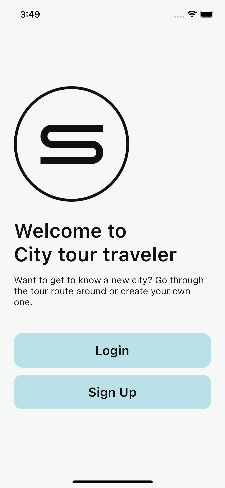

# Audio Tour Builder

A mobile app to compose audio tours and travel through them.

## About

The city audio tour app is a mobile application that allows users 
to create and explore personalized audio tours of cities and attractions. 
Users can compose their own tours by selecting points of interest on a map, 
adding audio descriptions, and then navigate through the tour using geolocation technology. 
They can listen to engaging audio content as they travel from one location to another, 
enhancing their understanding and enjoyment of the city's culture and history.

## Features

1. Create/Edit an audio tour
2. Add audio files and images to your tours
3. Travel through routes created by other users
4. Add any tour to favorites list

## Screenshots

### Splash screen. Login page. Register page

- Login to your account.
- Create a new account if you don't have one.
- Restore your forgotten password.

    
    
    
    
    

### Explore page. My Tours page

- Browse all tour by all users on Explore page.
- Search tours by the title using searchbar.
- Press the "Like" button to add the tour to favorites list or remove it.
- Create a tour on My Tours page.
- Go to the Profile page using the icon in the top right corner.

    
    
    

### Tour page

- Get an information about the tour like description,
walk distance or average travel time.
- Check out every place in the list.
- Add the tour to favorites.
- Edit or delete the tour if you are the owner.
- Start the tour in one click.

    
    
    

### Tour traveling page

- See the tour route and go from each place to the other.
- Listen to an audio of every place, read more about it in a description
and look at it's images.
- Finish the tour in advance at any time.

    
    
    

### Tour Builder page

- Build your own tour. Edit title and description, pick a cover image.
- Set places on the map and add information to each one.

- Edit location of any map marker by dragging,
change it's data in the info sheet or delete the marker in one click.   

    
    
    
    

### Profile page. Favorite Tours page

- Log out of your account.
- See your favorites lists and remove any tour if needed.

    
    
    

## Wireframes

## User Flow

## Packages used in development

This mobile app is built with:

| Packages                  | Usage                                    |
|---------------------------|------------------------------------------|
| **flutter_bloc**          | State management                         |
| **firebase_auth**         | Firebase Authentication                  |
| **firebase_storage**      | Firebase Storage for file storing        |
| **cloud_firestore**       | Firebase Database for user data storing  |
| **file_picker**           | Images and audio files picking           |
| **path_provider**         | Providing the paths of picked files      |
| **flutter_map**           | Mapping                                  |
| **geolocator**            | Providing user location                  |
| **permission_handler**    | App permission handling for file picking |
| **just_audio**            | Audio file playback                      |
| **just_audio_background** | Audio file playback in background        |